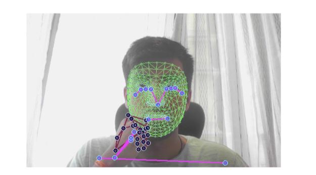
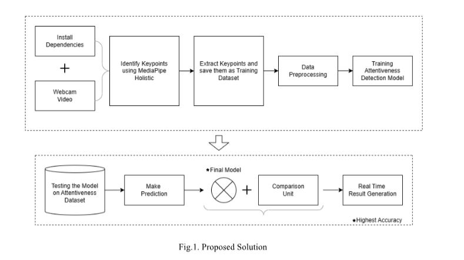
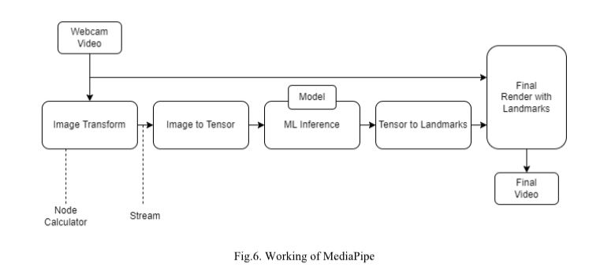
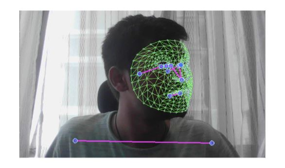
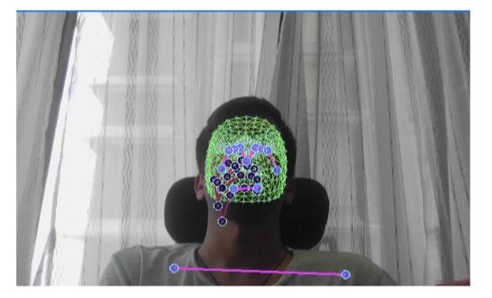
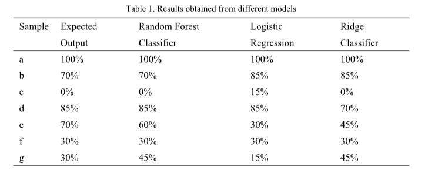
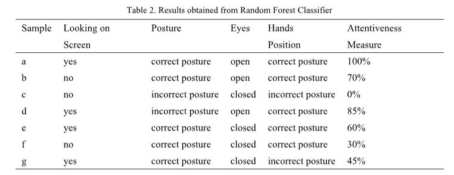

# Detecting Student's Attentiveness in the Classroom Using MediaPipe Holistic Framework

## Project Overview

This project proposes a solution that utilizes the MediaPipe Holistic Framework to detect and predict the attentiveness of students in a classroom based on their live video feed. The prediction is based on an evaluation of four different factors: looking at the screen, posture, eye position, and hand position. This solution is a combination of scientific research, practical considerations, and technological feasibility.

### Factors Explained

- **Looking at the Screen:** Students are more likely to pay attention when they are looking at the screen. This factor helps determine if the student is visually engaged in the lesson or distracted.

- **Posture (Body Language):** A student's posture can reveal their degree of involvement and comfort. Slouched or disengaged postures may indicate distraction or boredom, while upright and attentive postures are generally associated with active listening and engagement.

- **Eye Position:** The emotional mood and level of mental activity can be seen in a person's eyes. Increased interest and attention are often linked to dilated pupils, while narrowed pupils could signify lack of interest or exhaustion.

- **Hand Position:** Monitoring hand position can assist in determining if a student is actively engaged with the learning materials, such as taking notes or engaging in a hands-on activity. When students are not paying attention, they may fidget or engage in other distracting behaviors with their hands.

## How It Works

The system captures the live video feed of students during a classroom session. Using the MediaPipe Holistic Framework, key points are extracted from the video, and these points are used to evaluate the four factors mentioned above. A predictive model assesses the attentiveness of the student based on these factors and provides insights into their level of engagement in the classroom.

## Implementation Images

## Contributing

If you are interested in contributing to this project, we welcome your input. Here's how you can get involved:

1. **Fork the Repository:** Create your own copy of the project by forking it.

2. **Make Changes:** Create a new branch, make your changes, and commit them.

3. **Submit a Pull Request:** Push your changes to your forked repository and submit a pull request to the main repository.

## Contact

If you have questions, suggestions, or would like to collaborate on this project, please feel free to reach out to me:

- Email: glendhingra27@gmail.com

I am dedicated to enhancing classroom engagement through attentiveness detection and value your support and contributions.

---

*This project is open-source and available under the [MIT License](LICENSE.md).*
